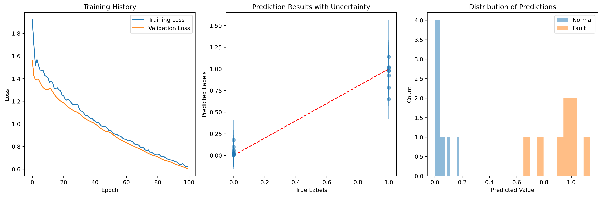

# Euler Characteristic-based Fault Detection System

This project implements a fault detection system using topological data analysis (Euler characteristics) combined with Bayesian Neural Networks for uncertainty quantification.

## Project Structure

```
Prognostics/
├── euler_faultdetection.py    # Core implementation
├── test_euler_faultdetection.py    # Synthetic data testing
├── custom_data_example.py     # Real data usage example
└── README.md
```

## File Descriptions

### euler_faultdetection.py
The core implementation containing two main classes:
- `EulerFaultDetector`: Computes topological features using Euler characteristics
- `BayesianFaultPredictor`: Implements the Bayesian Neural Network for fault prediction

### test_euler_faultdetection.py
A demonstration script that:
- Generates synthetic time series data (sine waves)
- Creates two classes of data: normal and faulty conditions
- Shows how the system performs on this controlled dataset
- Provides visualization of training process and results

Purpose: Used for testing the implementation and demonstrating the system's capabilities with clean, synthetic data.

### custom_data_example.py
A template script showing how to:
- Load and process your own data
- Train the model with real-world datasets
- Evaluate the results using standard metrics

Purpose: Serves as a starting point for implementing the system with real-world data.

## Key Differences Between Test and Custom Scripts

1. **Data Source**:
   - `test_euler_faultdetection.py`: Uses synthetic data (sine waves)
   - `custom_data_example.py`: Designed for real-world data

2. **Visualization**:
   - `test_euler_faultdetection.py`: Includes detailed visualization
   - `custom_data_example.py`: Focuses on metrics and practical evaluation

3. **Purpose**:
   - `test_euler_faultdetection.py`: Validation and demonstration
   - `custom_data_example.py`: Production usage template

## Getting Started

1. Create and activate a virtual environment (recommended):
```bash
# Create virtual environment
python -m venv euler_env

# Activate virtual environment
# On Windows:
euler_env\Scripts\activate
# On Unix or MacOS:
source euler_env/bin/activate
```

2. Install dependencies:
```bash
# Install TensorFlow and TF-Keras first
pip install tensorflow tf-keras

# Install TensorFlow Probability with TF support
pip install tensorflow-probability[tf]

# Install other required packages
pip install numpy gudhi persim mnist umap-learn scikit-learn matplotlib
```

3. Verify the installation:
```bash
python -c "import tensorflow as tf; import tensorflow_probability as tfp; print(f'TF version: {tf.__version__}\nTFP version: {tfp.__version__}')"
```

4. Run the test script:
```bash
python test_euler_faultdetection.py
```

## Troubleshooting

If you encounter the error "No module named 'tf_keras'", make sure to:
1. Install tf-keras explicitly: `pip install tf-keras`
2. Install tensorflow-probability with TF support: `pip install tensorflow-probability[tf]`
3. Make sure your Python environment has compatible versions of all packages

## Data Requirements

Your input data should be:
- Shape: (n_samples, sequence_length)
- sequence_length = segment_size × num_segments
- Default: segment_size=96, num_segments=10
- Labels: Binary (0 for normal, 1 for fault)

## Hyperparameters

Key parameters that can be adjusted:
- `num_points`: Number of filtration points (default: 20)
- `filtration_start`: Start value for filtration (default: 0.0)
- `filtration_end`: End value for filtration (default: 30)
- `segment_size`: Size of each data segment (default: 96)
- `num_segments`: Number of segments per sample (default: 10)

## Model Training

The Bayesian Neural Network can be customized with:
- Number of epochs
- Batch size
- Validation split ratio
- Network architecture (in euler_faultdetection.py)


## Results Visualization

The fault detection system generates three key visualizations:



The figure above shows three plots that demonstrate the system's performance:

1. **Training History** (Left):
   - Blue line: Training loss over epochs
   - Orange line: Validation loss over epochs
   - Shows model convergence and potential overfitting
   - Decreasing trends indicate successful learning

2. **Prediction Results with Uncertainty** (Middle):
   - X-axis: True labels (0: Normal, 1: Fault)
   - Y-axis: Predicted values with uncertainty bars
   - Red dashed line: Perfect prediction reference
   - Error bars: 95% confidence interval (±2 standard deviations)
   - Wider error bars indicate higher uncertainty in predictions

3. **Distribution of Predictions** (Right):
   - Shows separation between normal and fault predictions
   - Blue histogram: Distribution of predictions for normal cases
   - Orange histogram: Distribution of predictions for fault cases
   - Clear separation indicates good discrimination ability
   - Overlap areas suggest potential misclassification regions

### Interpretation

- **Training History**: The decreasing loss curves indicate successful model training. If validation loss increases while training loss continues to decrease, this suggests overfitting.

- **Prediction Results**: Points closer to the diagonal line indicate more accurate predictions. The error bars show prediction uncertainty - larger bars suggest less confident predictions.

- **Distribution Plot**: Better separation between the two histograms indicates better discrimination between normal and fault conditions. Overlap between distributions suggests regions where the model is less certain.
```

This README provides a clear overview of the project structure and helps users understand:
1. The purpose of each file
2. How to get started
3. How to use the system with their own data
4. Key parameters and configurations

You can place this README.md file in your Prognostics directory to provide documentation for users of your fault detection system.
