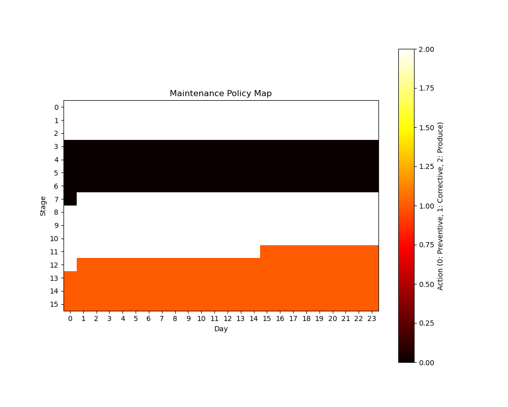

# Industrial AI: Predictive Maintenance, Anomaly Detection, and Power Prediction

This repository contains comprehensive implementations of industrial AI applications, including predictive maintenance, anomaly detection, power prediction, and prognostics.

## Project Structure

```
.
├── Anomaly Detection/               # Tensor-based anomaly detection
│   ├── tensordetect.py
│   └── README.md
├── Deep_Learning_for_Anomaly/      # Deep learning-based fault detection
│   ├── data_loader.py
│   ├── model.py
│   └── README.md
├── Maintenance_Optimization/        # RL-based maintenance scheduling
│   ├── data_processor.py
│   ├── maintenance_optimization.py
│   ├── rl_trainer.py
│   └── README.md
├── Power_Prediction/               # Power prediction using PRBNN
│   └── PRBNN_power_prediction/
│       ├── model/
│       └── README.md
├── environment.yml
└── README.md
```

## Setup

1. Clone the repository:
```bash
git clone https://github.com/yourusername/industrial-ai.git
cd industrial-ai
```

2. Create and activate the conda environment:
```bash
conda env create -f environment.yml
conda activate predictive-maintenance
```

## Components

### 1. Tensor-Based Anomaly Detection

Located in `Anomaly Detection/`, this component uses tensor decomposition and Hotelling's T² statistic for anomaly detection.

```python
from Anomaly_Detection.tensordetect import TensorHotellingT2

detector = TensorHotellingT2(rank=[3, 3, 3], alpha=0.05)
detector.fit(X_train)
predictions = detector.predict(X_test, method='T2')  # or 'residual' or 'both'
```

[Details](Anomaly_Detection/README.md)

### 2. Deep Learning for Anomaly Detection

Located in `Deep_Learning_for_Anomaly/`, this component implements CNN-based fault detection and prognostics.

```python
from Deep_Learning_for_Anomaly.model import CNNModel
from Deep_Learning_for_Anomaly.data_loader import DataLoader

# Load and preprocess data
data_loader = DataLoader('path/to/data')
X_train, y_train = data_loader.prepare_training_data()

# Train model
model = CNNModel()
model.train(X_train, y_train)
```

[Details](Deep_Learning_for_Anomaly/README.md)

### 3. Maintenance Optimization

Located in `Maintenance_Optimization/`, this component uses reinforcement learning for maintenance scheduling.

```python
from Maintenance_Optimization.data_processor import MaintenanceDataProcessor
from Maintenance_Optimization.maintenance_optimization import train_agent

# Process data
processor = MaintenanceDataProcessor()
processor.load_and_process_data('maintenance_log.csv')

# Train RL agent
train_agent(episodes=2000, batch_size=128)
```

[Details](Maintenance_Optimization/README.md)

### 4. Power Prediction

Located in `Power_Prediction/`, this component implements probabilistic power prediction using PRBNN.

```python
from Power_Prediction.PRBNN_power_prediction.model import PRBNNModel

model = PRBNNModel()
model.fit(X_train, y_train)
predictions = model.predict(X_test)
```

[Details](Power_Prediction/PRBNN_power_prediction/README.md)

## Data Requirements

### Maintenance Log Format
- `PROBLEMCODE`: Component identifier
- `Inverter`: Equipment identifier
- `Module`: Module identifier
- `REPORTDATE`: Date of maintenance event

### Tensor Data Format
- Numpy arrays or compatible tensor formats
- Consistent dimensions across samples
- Normalized/preprocessed as needed

### Time Series Data Format
For deep learning models:
- Structured time series data
- Multiple sensor measurements
- Labeled fault conditions

### Power Prediction Data
- Time-stamped power measurements
- Environmental conditions
- Operating parameters

## Output Files

Each component generates specific outputs:

### Maintenance Optimization
- `model_params/maintenance_policy.pth`: Trained policy network
- `model_params/weibull_parameters.json`: Reliability parameters
- `plots/policy_map.png`: Policy visualization
- `plots/training_history.png`: Training history

### Deep Learning Models
- `results/detection/models/`: Saved model weights
- `results/detection/images/`: Performance visualizations
- `results/prognostics/`: Prognostics results

### Power Prediction
- Trained model checkpoints
- Prediction uncertainty estimates
- Performance metrics

## Example Results


### 1. Maintenance Policy Optimization

```
Maintenance policy visualization:
- X-axis: Time periods
- Y-axis: Equipment state
- Colors: Recommended actions
  - Blue: Preventive maintenance
  - Yellow: Continue operation
  - Red: Corrective maintenance
```

### 4. Power Prediction Results

```
PRBNN prediction results showing:
- Actual vs. predicted power output
- Uncertainty bounds (95% confidence)
- Error distribution analysis
```

### 5. Training Progress

```
Training metrics across components:
- Loss convergence
- Validation performance
- Model optimization progress
```

## Logging and Monitoring

```python
import logging
logging.basicConfig(
    level=logging.INFO,
    format='%(asctime)s - %(levelname)s - %(message)s',
    handlers=[
        logging.FileHandler('training.log'),
        logging.StreamHandler()
    ]
)
```

## Contributing

1. Fork the repository
2. Create your feature branch
3. Commit your changes
4. Push to the branch
5. Create a Pull Request

## License

This project is licensed under the MIT License - see the LICENSE file for details.

## Future Work
- [ ] Add data from solar PV system (Generated AI) to the repository for the Anomaly Detection, Power Prediction, and Prognostics
- [ ] Add more benchmark models for the Anomaly Detection and Prognostics

## Citation

If you use this code in your research, please cite:

```bibtex
@software{haoyan_pvanomaly_2024,
  author = {Hao Yan, Jiayu Huang, Jiuyun Hu, Boyang Xu, Nan Xu, Yongming Liu},
  title = {PVAnomlay: Predictive Maintenance and Anomaly Detection for SolarPV System},
  year = {2024},
  publisher = {GitHub},
  url = {https://github.com/hyan46/PVAnomaly}
}
```
